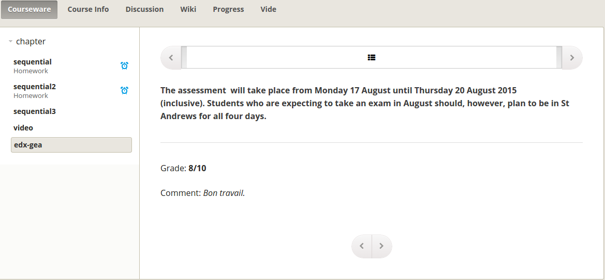

Grade External Activity XBlock
==============================

This XBlock provides a way to grade external activity in edx-platform.
The course staff will upload a simple csv containing usernames, grades and optional comments.
Then through the same XBlock students will see their evaluation.

.. image:: https://circleci.com/gh/openfun/edx-gea/tree/master.svg?style=svg
    :target: https://circleci.com/gh/openfun/edx-gea/tree/master

Installation
~~~~~~~~~~~~

1. Install edx-gea

     .. code:: sh
          pip install --extra-index-url https://pypi.fury.io/openfun edx-gea

2. Add edx\_gea to installed Django apps

   - In ``/edx/app/edxapp/edx-platform/cms/envs/common.py``, add ``'edx_gea'``
     to OPTIONAL_APPS

   - In ``/edx/app/edxapp/edx-platform/lms/envs/common.py``, add ``'edx_gea'``
     to OPTIONAL_APPS

Documentation
~~~~~~~~~~~~~

 http://edx-gea.readthedocs.org
